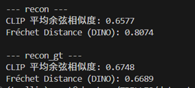
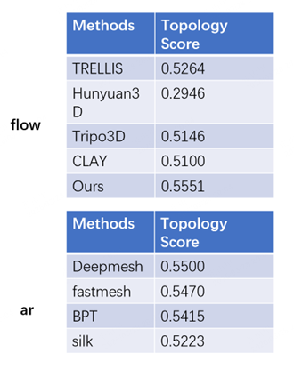

## Reviewer 1

### Topology Quality & Quantitative Comparison

*Table R1-1: Topology Score (TS) evaluation comparing our method against flow-based and AR-based baselines.*

*Table R1-2: CLIP and Fréchet Distance (DINO) metrics comparison for reconstruction.*

*Table R1-3: Quantitative comparison (CD, HD, TS, CLIP) against TRELLIS.*

*Table R1-4: FID and KID evaluation comparing TRELLIS vs. GT and Ours (Lato) vs. GT.*

### Inference Time Comparison

*Figure R1-1: Inference time comparison between our method and existing baseline models across different face numbers.*

### Ablation Study on Sampling Strategy

*Table R1-5: Quantitative evaluation (CD, HD, NC) of VAE reconstruction quality under different total sample point configurations (Nn+Nr).*

---