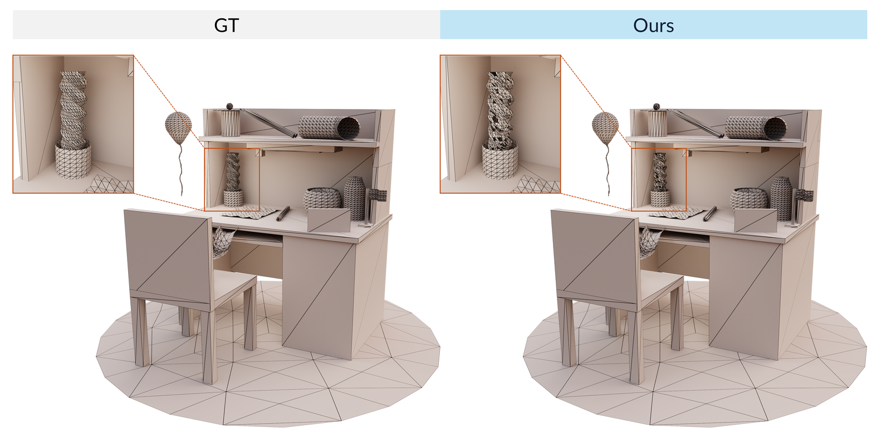

## Reviewer 2

### W1: Reliance on 0.5 Threshold Might Lead to Noise or Missing Vertices in Very Thin or Complex Areas

<!-- 

_Figure R2-W1-a: The situation of missing faces occurs in areas with dense polygons._
 -->

<em>Figure R2-W1-a: The situation of missing faces occurs in areas with dense polygons.</em>

