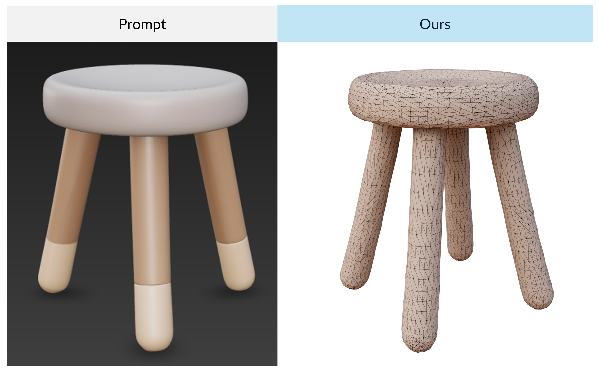
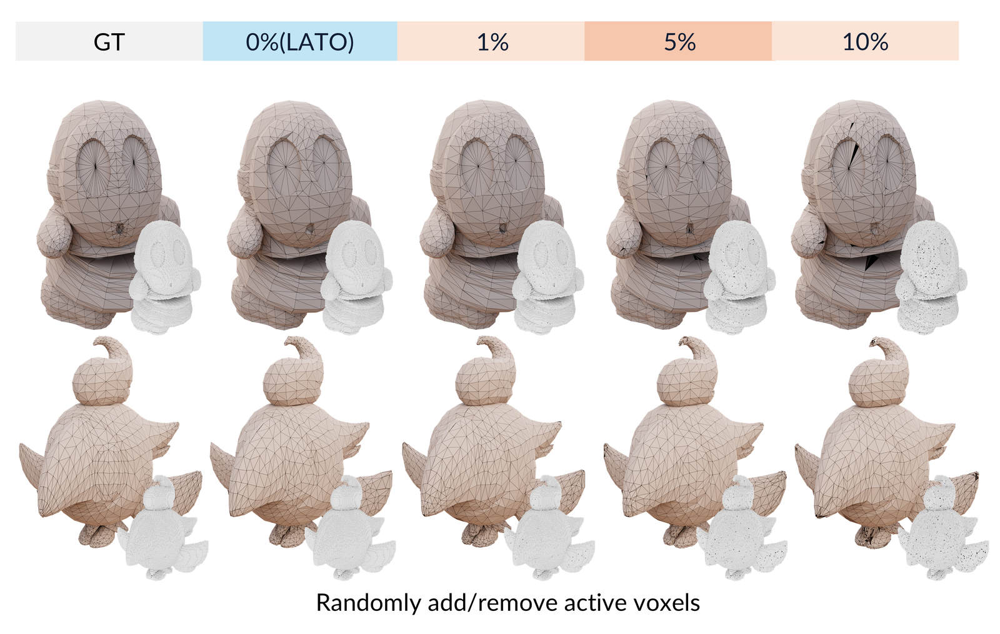

## Reviewer 2

### W2: Error Propagation from the Initial Voxel and Open Surface

_Figure R2-W2-a: In the case of the structure model generates four legs for a three leg chair, LATO generation result._

_Figure R2-W2-b: In the case of double-layer faces with very close spacing (where the distance between the two face patches is less than the minimum spacing that a voxel can represent), LATO tends to generate a single-layer face._

_Figure R2-W2-c: In the case of randomly add/remove 1\%, 5\%, 10\% of the structural voxels, LATO generation results._
