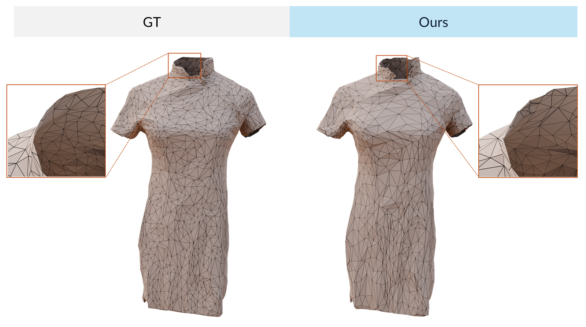
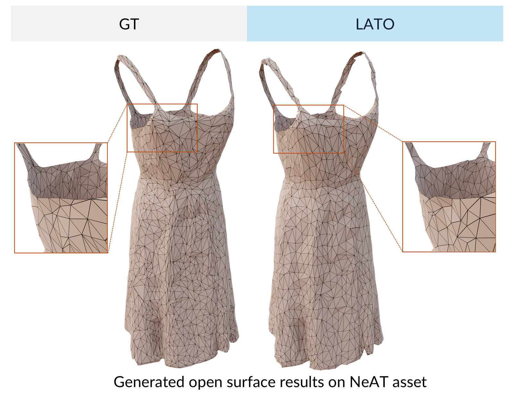

## Reviewer 2

### W3: Open Surface Generation Results using Cases in NeAT

_Figure R2-W3-a: LATO can perfectly achieve the generation of the open surface._

_Figure R2-W3-b: LATO can perfectly achieve the generation of the open surface._
