### W1: Vertex Accuracy and Dense Area Visualization
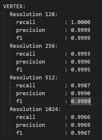
*Table R2-1: Vertex precision, recall, and F1 score of our VAE across various resolutions (128, 256, 512, 1024).*

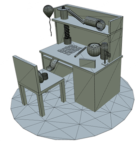
*Figure R2-1a: Visualization of generated topology in dense and complex areas (e.g., desk, chair, and detailed objects).*

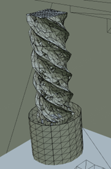
*Figure R2-1b: Visualization of generated topology in dense and complex areas (e.g., spiral column structure).*

### W2: Error Propagation & Failure Cases
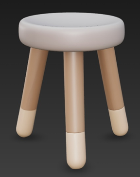
*Figure R2-2a: Failure Case Analysis - Rendered reference image of a stool.*

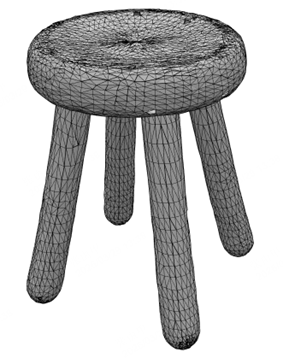
*Figure R2-2b: Failure Case Analysis - Our generated mesh resulting in a "five-legged stool" due to initial voxel structure ambiguity.*

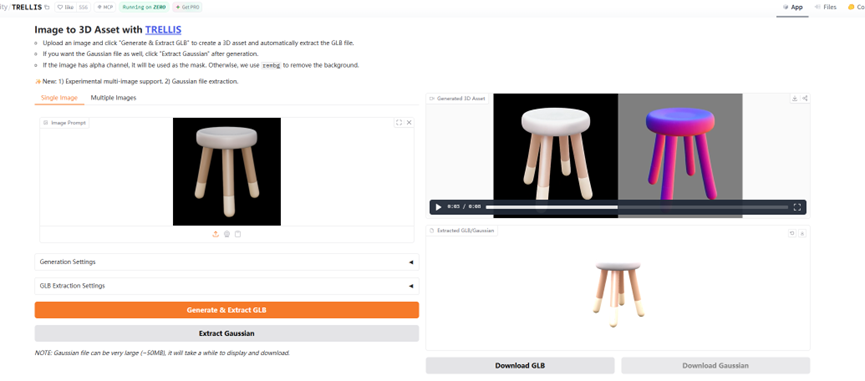
*Figure R2-2c: Failure Case Analysis - TRELLIS web interface generation result for the same input.*

### W2 & W3: Open Surface Generation Examples
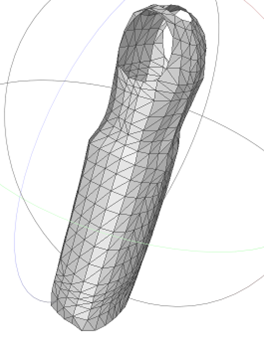
*Figure R2-3a: Open Surface Comparison - Ground Truth mesh of a dress.*

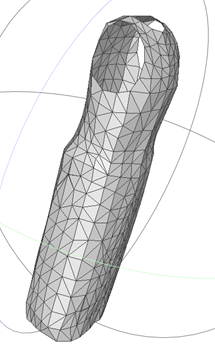
*Figure R2-3b: Open Surface Comparison - Our generated mesh correctly predicting an open, single-layer surface.*

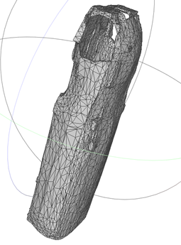
*Figure R2-3c: Open Surface Comparison - TRELLIS result showing an incorrect double-layer or broken surface.*

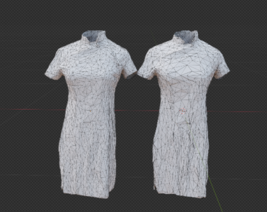
*Figure R2-4a: Additional Open Surface Examples - Generated meshes of Qipao dresses.*

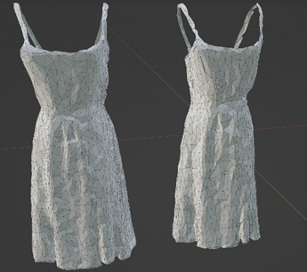
*Figure R2-4b: Additional Open Surface Examples - Generated meshes of sling dresses.*

### W4: Inference Time Breakdown
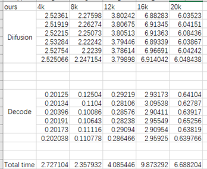
*Table R2-2: Detailed breakdown of inference time showing specific diffusion and decode times across different voxel counts.*

### W5: Wireframe Comparison
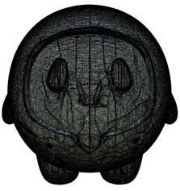
*Figure R2-5a: Wireframe visual comparison - Mesh generated by Hunyuan 3.1.*

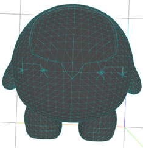
*Figure R2-5b: Wireframe visual comparison - Wireframe structure generated by Hunyuan.*

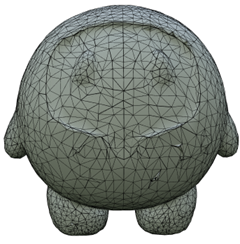
*Figure R2-5c: Wireframe visual comparison - Mesh generated by our method.*

*Figure R2-5d: Wireframe visual comparison - Mesh generated by TRELLIS 2.*

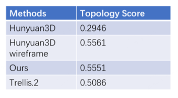
*Table R2-3: Topology Score evaluation comparing Hunyuan3D, Hunyuan3D wireframe, Ours, and TRELLIS 2.*

### W6: Closed, Water-tight Surfaces Constraints
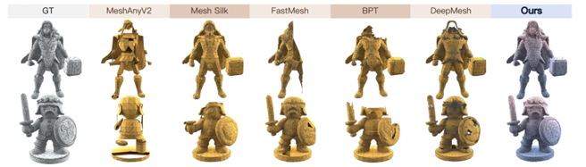
*Figure R2-6: Visual comparison demonstrating our method's ability to reliably generate closed, water-tight surfaces compared to other baselines.*

### W7: VDF Minimum Sampling Density
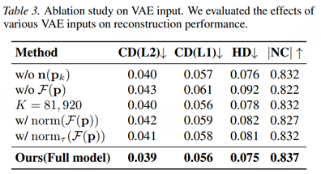
*Table R2-4: Ablation study evaluating the effects of various VAE inputs and VDF constraints on reconstruction performance.*

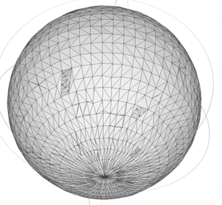
*Figure R2-7a: Visual effect of sampling density - Reconstruction using 81,920 sample points.*

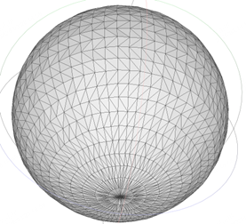
*Figure R2-7b: Visual effect of sampling density - Reconstruction using 819,200 sample points.*

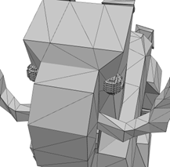
*Figure R2-8a: Visual effect of sampling strategy - Mesh reconstructed with additional uniform sampling on each face.*

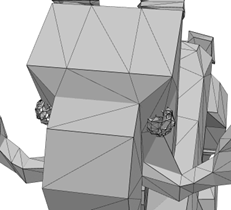
*Figure R2-8b: Visual effect of sampling strategy - Mesh reconstructed using only face area sampling.*

### W8: Artist-Friendly Topology User Study
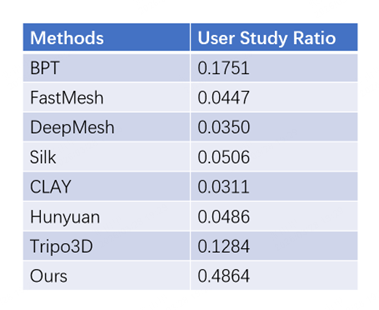
*Table R2-5: User study ratio results evaluating the preference for "artist-friendly" topology across different methods.*