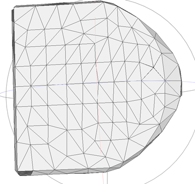
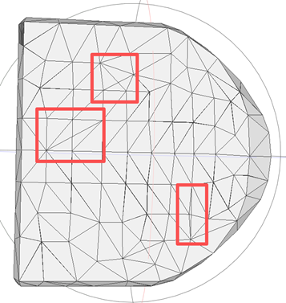

## Reviewer 3

### W1: Prevention of Self-Intersecting Meshes and Isolated Faces

*Figure R3-1a: Cross-section of a mesh trained WITH the VDF constraint, showing clean internal geometry without self-intersections.*

*Figure R3-1b: Cross-section of a mesh trained WITHOUT the VDF constraint. Red boxes highlight artifacts, isolated faces, and self-intersecting edges.*